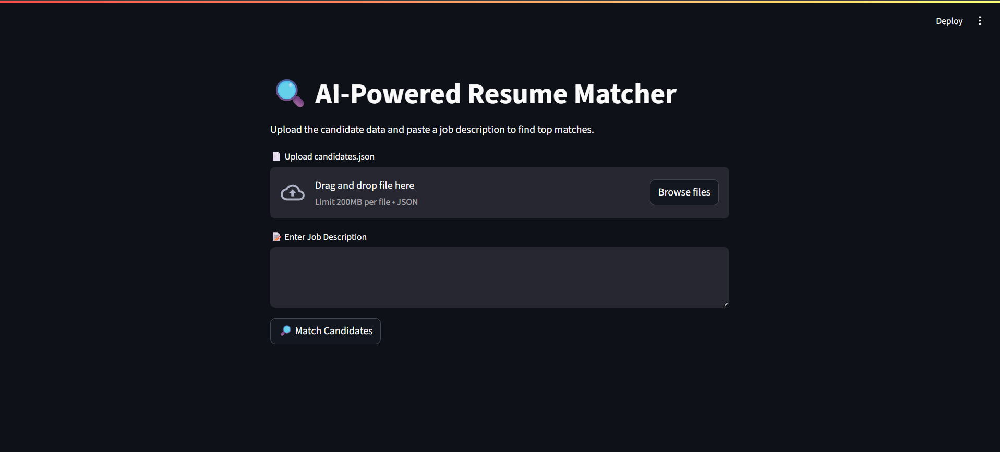

## AI-Powered Resume Matcher
## Project Overview
This project implements an AI-powered resume matching system that semantically matches candidate resumes to a given job description. It leverages local embeddings generated by sentence-transformers for similarity calculation and utilizes the Google Gemini API to provide natural-language explanations for why top-matching candidates are a good fit.
The system is designed to act as an AI assistant for recruiters, streamlining the initial screening process by providing ranked candidates and insightful explanations.
## Problem Statement
Recruiters often face the challenge of sifting through numerous resumes to find the best fit for a job description. This project aims to automate and enhance this process by:
1. Semantically matching resumes to job descriptions, going beyond keyword matching.
2. Providing a ranked list of top candidates based on their relevance.
3. Generating clear, concise explanations for the fit, powered by Gemini, to aid in decision-making.
## Features
* Candidate Data Ingestion: Reads candidate profiles from a candidates.json file.
* Semantic Embedding: Extracts job_title, skills, and summary from resumes and converts them into dense vector embeddings using Sentence Transformers (all-MiniLM-L6-v2).
* Efficient Vector Storage: Stores candidate embeddings in a local FAISS vector index for fast similarity search.
* Job Description Matching: Accepts a free-text job description and finds the most similar candidates from the indexed resumes using cosine similarity.
* Gemini-Powered Explanations: Generates natural-language explanations for why each top candidate is a good fit for the job, using the Google Gemini 2.5 Pro API.
* Interactive Streamlit UI (Optional): Provides a user-friendly web interface to upload candidate data, input job descriptions, view top matches, and see AI-generated explanations.
## 📁 Project Structure

```
resume-matcher/
├── data/
│   └── candidates.json         # Input candidate resumes (sample provided)
├── embeddings/
│   ├── index.faiss             # FAISS vector index (generated by build_index.py)
│   └── metadata.pkl            # Raw candidate info mapped by vector (generated by build_index.py)
├── build_index.py              # Script to build and store candidate embeddings
├── match_job.py                # Script to perform job description matching and retrieve top candidates
├── explain.py                  # Script to generate natural-language match explanations using Gemini
├── app.py                      # (Optional) Streamlit UI for interactive demo
├── requirements.txt            # Project dependencies
└── README.md                   # This document
```
## Installation
To set up the project locally, follow these steps:
1. Clone the repository:
```
git clone <your-repository-url>
cd resume-matcher
```
2. Create a virtual environment (recommended):
```
python -m venv venv
# On Windows:
.\venv\Scripts\activate
# On macOS/Linux:
source venv/bin/activate
```

3. Install dependencies:
The project relies on the packages listed in ```requirements.txt.```
```pip install -r requirements.txt```

   * Note on ```faiss-cpu```: If you encounter issues installing ```faiss-cpu```, you might need to install it from source or consider ```faiss-gpu``` if you have a CUDA-enabled GPU.
## API Key Configuration
This project uses the Google Gemini API for generating explanations.
   1. Get your API Key: Obtain a Gemini API key from the Google AI Studio.
   2. Set as Environment Variable: It's recommended to set your API key as an environment variable named ```GOOGLE_API_KEY.```
   * On Windows (Command Prompt):
```set GOOGLE_API_KEY="YOUR_API_KEY_HERE"```

   * On macOS/Linux (Bash/Zsh):
```export GOOGLE_API_KEY="YOUR_API_KEY_HERE"```

   * Alternatively, you can directly paste your API key into the ```GOOGLE_API_KEY``` variable in ```build_index.py```, ```match_job.py```, ```explain.py```, and ```app.py``` files, but this is less secure for public repositories.
## Usage
Follow these steps to use the resume matcher:
### 1. Prepare Candidate Data
Place your candidates.json file inside the data/ directory. A sample candidates.json with 5-10 candidates should be provided.
### 2. Build the Resume Index
Run the build_index.py script to process your candidate data, generate embeddings, and store them in the embeddings/ directory.
```python build_index.py```
This will create ```embeddings/index.faiss``` and ```embeddings/metadata.pkl.```
### 3. Match a Job Description (Command Line)
You can test the matching functionality directly via ```match_job.py```. This script will take a job description as input and return top candidates.
```python match_job.py```
The script will prompt you to enter a job description.

Sample Output (from ```match_job.py```):
```
[
 {
   "id": "cand_001",
   "name": "Jane Doe",
   "job_title": "Backend Engineer",
   "skills": ["Python", "Django", "PostgreSQL"],
   "score": 0.87
 },
 {
   "id": "cand_002",
   "name": "John Smith",
   "job_title": "Frontend Developer",
   "skills": ["React", "JavaScript", "CSS"],
   "score": 0.72
 }
]
```
### 4. Generate Explanations (Command Line)
The explain.py script can generate a natural-language explanation for a single candidate's fit to a job description.
```
python explain.py
# The script will prompt you to enter job description and candidate details.
```

### 5. Run the Streamlit UI (Optional)
For an interactive experience, launch the Streamlit application.

```streamlit run app.py```
### Screenshot of the Streamlit UI:


This will open a web interface in your browser where you can:
1) Upload your ```candidates.json``` file.
2) Paste a job description.
3) Click a button to display top matches, their scores, and Gemini-generated explanations.

## Contributing
Feel free to fork this repository and contribute! Please open an issue first to discuss what you would like to change.
## License
This project is licensed under the MIT License - see the ```LICENSE``` file for details (if you plan to add one).
